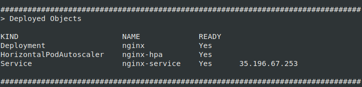

# GKE Deploy

This tool deploys an application to a Kubernetes Engine cluster, following
Google's recommended best practices.

## `gke-deploy` vs `kubectl`

Using `gke-deploy` to deploy an application to Kubernetes Engine differs from
`kubectl` in that `gke-deploy` is a wrapper around a [`kubectl
apply`](https://kubernetes.io/docs/reference/generated/kubectl/kubectl-commands#apply)
deployment that follows Google's recommended best practices by...

*   Modifying a set of Kubernetes configuration files to use a container image's
    digest instead of a tag

*   Adding several [recommended
    labels](https://kubernetes.io/docs/concepts/overview/working-with-objects/common-labels/#labels)
    to the set of Kubernetes configuration files

*   Getting authorized to access a GKE cluster

*   Applying the set of Kubernetes configuration files that were modified in the
    prepare step, using `kubectl apply`

*   Waiting for applied Kubernetes configuration to be ready

## Usage

[`gke-deploy run [flags]`](doc/gke-deploy_run.md)

This command executes all of the best practices mentioned above, in sequence.

[`gke-deploy prepare [flags]`](doc/gke-deploy_prepare.md)

This command executes the steps to modify and add labels to a set of Kubernetes
configuration files, and skips the steps to get authorized to access a GKE
cluster, apply configuration, and wait.

[`gke-deploy apply [flags]`](doc/gke-deploy_apply.md)

This command skips the steps to modify and add labels to a set of Kubernetes
configuration files, and executes the steps to get authorized to access a GKE
cluster, apply configuration, and wait.

## [Deploying with Cloud Build](doc/deploying-with-cloud-build.md)

View [this page](doc/deploying-with-cloud-build.md) for examples on how to use
`gke-deploy` with Cloud Build.

## [Automated Deployments with Cloud Build](doc/automated-deployments.md)

Follow [these instructions](doc/automated-deployments.md) to set up continuous
deployment.

## Testing Locally

Although `gke-deploy` is meant to be used as a build step with [Cloud
Build](https://cloud.google.com/cloud-build/), you can run it locally for testing.

1.  First, install
    [`kubectl`](https://kubernetes.io/docs/tasks/tools/install-kubectl/) as a
    dependency.

2.  Next, install `gke-deploy`:

    ```bash
    go get github.com/GoogleCloudPlatform/cloud-builders/gke-deploy
    gke-deploy -h
    ```

3.  If your `kubectl` is pointing to a cluster, you can test out a deployment by
    deploying an application with one simple command:

    ```bash
    # Deploy an nginx Deployment with a load balancer exposing port 80.
    gke-deploy run -i nginx -x 80
    ```

4.  After the command finishes successfully, `gke-deploy` will print a table
    displaying deployed resources. You can visit the IP address printed in the
    Service row.

    e.g.,

    

    ```bash
    curl 35.196.67.253
    ```
